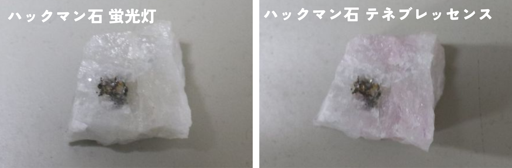
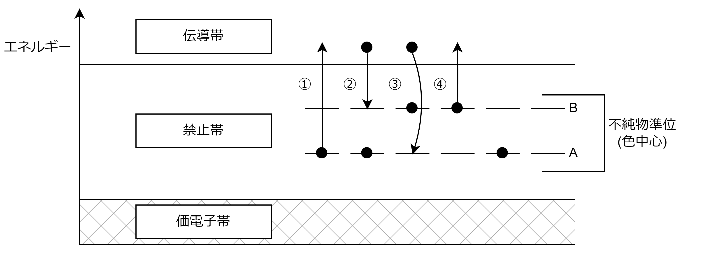

※上記の画像をクリックするとシミュレーションが起動します。

## 蛍光・テネブレッセンスの定義

本ページで解説する蛍光とは、鉱物に紫外線を当てた場合、その鉱物が光る現象を指します。また、テネブレッセンス (tenebrescence/統一された日本語訳がないようですので、本教材ではカタカナ表記の「テネブレッセンス」と呼びます) とは、短波紫外線 (本教材では254nm) を照射すると、石の色が変わる現象を指します。テネブレッセンス状態でも、蛍光灯の下で数分間放置すると元の色に戻り、再び短波紫外線を照射すると色が変わります。なお、ラテン語で闇を表す「tenebrae」が語源になっています。

## 蛍光・テネブレッセンスを示す鉱物

蛍光を示す鉱物は数多くあり、本教材で扱っている鉱物はほぼすべてが蛍光を示します(ただし、同じ鉱物であっても、ものによって蛍光しないものもありますので、蛍光の観察目的で購入する際などは注意が必要です)。身近な鉱物であれば、ダイヤモンドやオパールなども蛍光を示します。

一方、テネブレッセンスを示す鉱物は多くはありません。本教材で扱っているハックマン石のほか、スキャポライト(柱石)もテネブレッセンスを示すことで有名です(ただし、同じ鉱物であっても、ものによってテネブレッセンスしないものもありますので、テネブレッセンスの観察目的で購入する際などは注意が必要です)。

## 蛍光・テネブレッセンスの原理

### 簡易的な説明

これはエネルギーの高低を場所の高低に準えた電子の動きのイメージ図です。

紫外線は波長が短い分、高いエネルギーを持ちます。そのため、紫外線が当たるとその物質の電子のエネルギーも高くなり、エネルギーを蓄えます(高い位置に移動するイメージ)。ただし、この位置は不安定なため、電子は元の安定した位置まで落ちようとします。このとき、電子が持っていたエネルギーが、熱のほかに、光エネルギーとして放出されます。これが蛍光として見えるのです。

 一方、テネブレッセンスは、高い位置から落ちる際、一部の電子が元の位置ではなく、途中の高さまでしか落ちないことが原因で起こります。この位置にいる電子は、元の位置よりも高いエネルギーを持っている状態です。そのため、可視光線のような、低いエネルギーを与えるだけでも高い場所に移動できます。このとき、可視光線の白い光のうち、特定の色のみを吸収するため、吸収されなかった色が反射して、石に色が付いたように見えます。これがテネブレッセンスです。なお、この高い場所から落ちる際も光エネルギーは放出されますが、照明の光よりは弱いので、私たちの目には蛍光しているようには見えません。

### 詳しい説明

蛍光とテネブレッセンスの原理は、バンド理論によって説明できる。
図中の用語の意味は次の通りである。

価電子帯：電子が充満しているバンドのこと。同じ結晶中の最外殻の電子がとるエネルギーは、すべて異なる(パウリの排他理論)。この最外殻電子がとるエネルギーの幅とも考えられる。
禁止帯：価電子帯と伝導帯にあいだにあるギャップのこと。
伝導帯：価電子帯・禁止帯よりエネルギーが高い位置にある、電子があまり存在しないバンドのこと。

鉱物に入り込んだ不純物は、結晶中の禁止帯に電子を持つ。この位置を不純物準位という。また、着色を誘起するため、色中心でもある。この不純物準位にある電子が遷移することによって蛍光やテネブレッセンスが起こる。

まず、図中の①のように、Aの準位に入っていた電子が、紫外線によって伝導帯まで励起される。しかしこの位置では不安定なため、②のように、安定している禁止帯まで戻ろうとする。この時に熱及び光エネルギーが発せられ、それが私たちの目には蛍光しているように見える。③のように、Aの位置まで落ちることもあるが、この際は紫外線に近い光を放出するため、蛍光として視認できない。

Bの準位に入っている電子は既に比較的エネルギーが高い状態であるので、④で示す通り、可視光線のような低いエネルギーの光源でも励起される。この際、Aの準位とBの準位のエネルギー差に最も近い波長が効率よく吸収され、それ以外の波長が反射することでテネブレッセンスとして色づいて見える。

なお、Aの準位からBの準位まで直接遷移することはできない(光学遷移選択則)ため、紫外線を当てるまでテネブレッセンスは起きない。

## スペクトルとは

どの波長(色)がどの程度の割合で含まれているのかを表した値です。どの波長がどの色に対応するのかのおよその目安は、各スペクトルのグラフの下部に表示しています。どこの波長(色)が一番強いのか、波長(色)の強度(強ければ強いほど明るい)や、ピークの幅(鋭さ)などの情報から、色の特徴をつかむことができます。

## 参考文献

- [ニュートンプレス (2022)：鉱物大図鑑， ニュートンプレス](https://www.newtonpress.co.jp/book/Daizukan/220620-Mineralzukan.html)
- [D. B. Medved(1954)：HACKMANITE AND ITS TENEBRESCENT PROPERTIES ， American Mineralogist， 9 (7-8): 615–629．](https://www.semanticscholar.org/paper/HACKMANITE-AND-ITS-TENEBRESCENT-PROPERTIES-MBnvEo/51749aa2c0c662a2be23b2cffbf0fbca7878363a#citing-papers)
