※上記の画像をクリックするとシミュレーションが起動します。

〈グラフ無しverはこちらから〉
 "<https://app.bicpema.com/simulations/cellophane_display>"

## 扱っている現象および本教材の説明

(ア)．Polage Artの起源と実際．

　アメリカの芸術家Austine Wood Comarow（1942～2020）がパイオニアとなる芸術様式の1種にPolage Art(The art of the polarization collage Art)がある。物理現象である偏光が生み出す色（偏光色）を活用した芸術様式であり，偏光板の回転や見る角度によって違った見方や表現となるといった特徴を持っている。図1はそのようなPolage芸術の具体的な作品の1例となる[[1](https://www.austine.com/swarthmore-college)]。この芸術様式は日本でもみられ，その中の一部は学校現場や子どもを対象とした科学体験のイベントホールなどで目にすることができ，Webサイトにはそれらに関連する資料を確認することもできる[[2](https://www.exploratorium.edu/snacks/polarized-light-mosaic)]。図2のようにセロハンテープなどの簡易なフィルムを重ね合わせ，偏光板で観察することによって色鮮やかな表現を楽しませることが出来るものは，偏光アートとも呼ばれ，科学体験やデモンストレーション科学として多く親しまれており，科学キットとして販売されている事例もある[[3](https://www．Amazon.co.jp/偏光板でにじ色を作ろう-バラエティ-Gakken/dp/4057508562)]。

    

        

            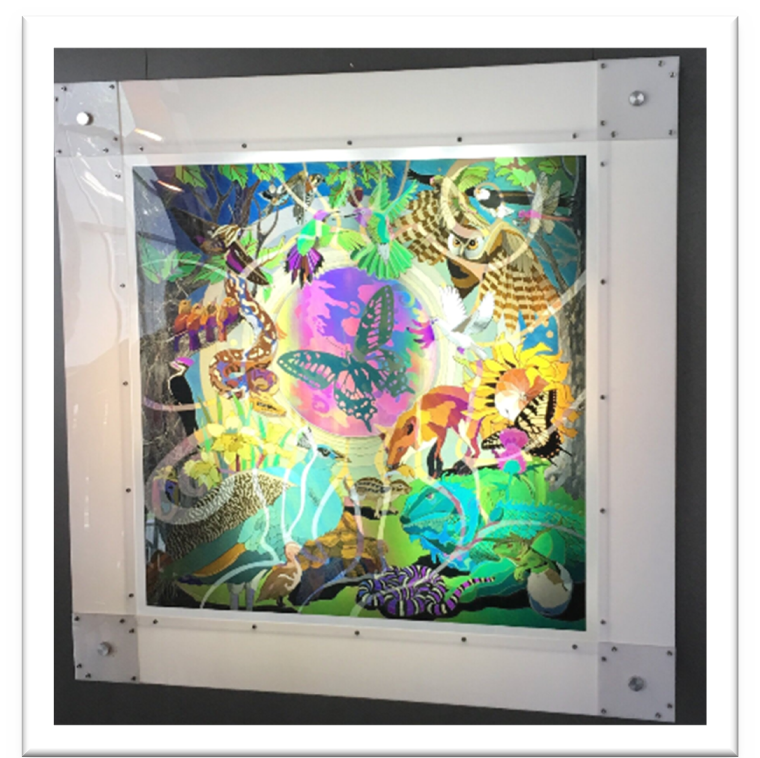
            
図１ Polage Artの一例

        

        

            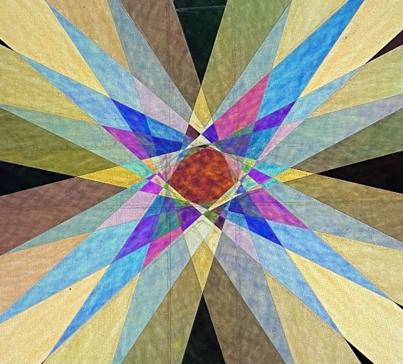
            
図２ セロハンテープアートの一例

        

    

(イ)．偏光と偏光色

　自然光は振動方向がランダムに入り混じっているが(Unpolarized)，偏光板をかざすことで”ある”振動方向の光だけを得ることが出来る(図3)。得られた光は直線偏光と呼ばれる。高等学校の物理では，光が横波であることの導入として扱われる。PCの画面も直線偏光であり，偏光板をかざすと光を遮ることが出来る。

    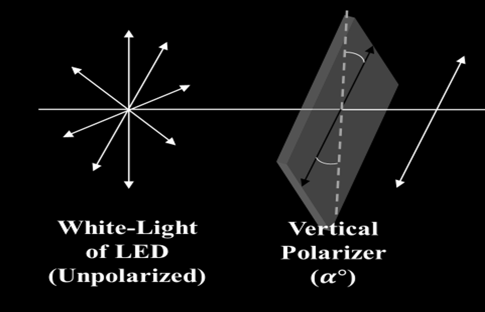
    
図３ 無偏光と偏光板による直線偏光

　直線偏光は図4のスリットモデルと光の波動性を用いて説明される。2枚の偏光板に光を通した際に，1枚目の偏光板で直線偏光が作られる。2枚目の偏光板の向きが1枚目と直交する場合には，直線偏光の透過を遮断してしまう。

    
    
図4 スリットモデル: 2枚目の偏光板に遮断される直線偏光

　しかし，2枚の偏光板の間にセロハンテープを1枚挟むと光が透過したりできなくなったりする現象が，2枚の偏光板を平行にした場合(平行ニコル配置)と直交にした場合(直交ニコル配置)の双方で確認される(図5)。スリットモデル(図4)に従えば，1枚目による直線偏光がセロハンテープによって変化した(向きを90°回転させられた)結果と考えられる。

    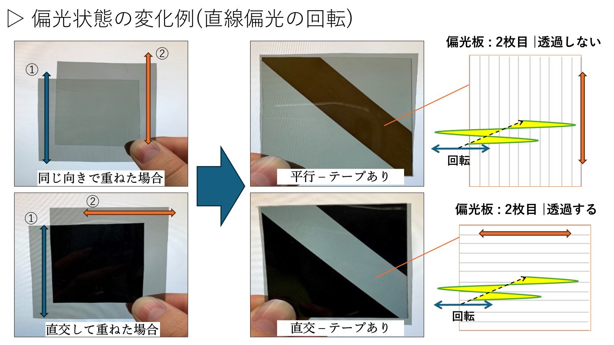
    
図5 2枚の偏光板の間にセロハンテープを挟んだ場合

テープの枚数や角度，種類によっては偏光状態の変化が複雑になり色が起こるようになる。この発色が偏光色であり，Polage Artで利用されている。

(ウ)．偏光状態の変化と光路差(テープの個体差がある物理量)

　偏光色には複屈折物質と呼ばれる，透過させる際に入射光の偏光状態を変化させる物質が必要になる。Polage Artでは，セロハンテープが該当する。この複屈折物質は，分子(原子)配列に方向性がある物質であり，異方性（屈折率n-光の進みやすさ-が方向によって異なる性質）を持つ。
一般的にセロハンテープはx軸方向（セロハンテープの幅方向）の屈折率は小さく，y軸方向（セロハンテープの長さ方向ー高分子の伸び方向ー）で屈折率が大きい。

    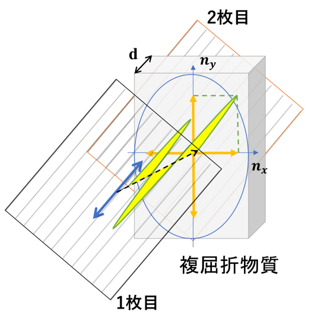
    
図6 複屈折物質と光の分解図

　図6のように，2つの屈折率軸に対して丁度中間の角度で光を入射した際には，2軸上で強さが等しく速度の異なる2本の光線に光を分解して現象を捉える。

    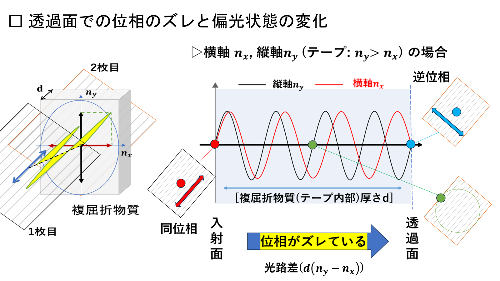
    
図7-a 複屈折物質による偏光状態の変化

　そして，同位相であった2つの直交関係の光波は，物質面を透過して外部に出る際に位相のズレが生じることで，合成波が入射光とは異なる偏光状態となる。
この波のズレは, 1枚当たりのx軸方向とy軸方向の屈折率の差Δnと1枚当たりのセロハンテープの厚さdに起因する。両者の積dΔnを光路差といい，位相のズレの指標となる。

    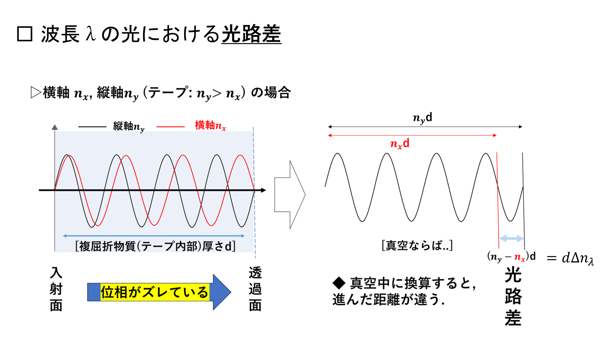
    
図7-b 複屈折物質による偏光状態の変化

　光路差(dΔn)は，真空に換算した際の光の進んだ距離の差(光学距離の差)とも捉えられる。屈折率∆𝑛_xのx軸上では，光学距離は𝑑∆𝑛_x。屈折率∆𝑛_yのy軸上では，光学距離は𝑑∆𝑛_y。この差𝑑[∆𝑛_y-∆𝑛_x](単位は nm)を波長(λ)で割って，位相2πをかけると2軸での波のズレ(位相差)とみなせる。

　図7-aの場合，テープ入射面では位相のズレはなく, 光は赤の矢印の振動をとる。一方で透過面では位相がπずれており(逆位相)，合成光は青の矢印の振動となり入射光と異なる。
図7で示したような偏光状態の変化が，可視広域の各波長によって異なるために，2枚目の偏光板は特定の波長を選択的に透過させるようになる．
よって，白色光から一部の波長が選択的に透過し色づいて見えるようになる．

## [セロハンによる偏光状態の変化を直観的に理解する教材](https://bicpema-blog.web.app/p/%E3%82%BB%E3%83%AD%E3%83%8F%E3%83%B3%E3%81%AB%E3%82%88%E3%82%8B%E5%81%8F%E5%85%89%E3%81%AE%E5%A4%89%E5%8C%96/)

　白色光を偏光板2枚で挟んだセロハンテープに入射した際に，波長(青-450 nm, 緑-550 nm, 赤-600 nm)によって偏光状態の変化に違いが出る様子と，予想される色をこちらのシミュレーションからも確認することができる。

    
    
図8 セロハンによる偏光の変化のシミュレーション

## 対象

既に波動について学習している高校生以上の生徒・大学生

## 使用方法

    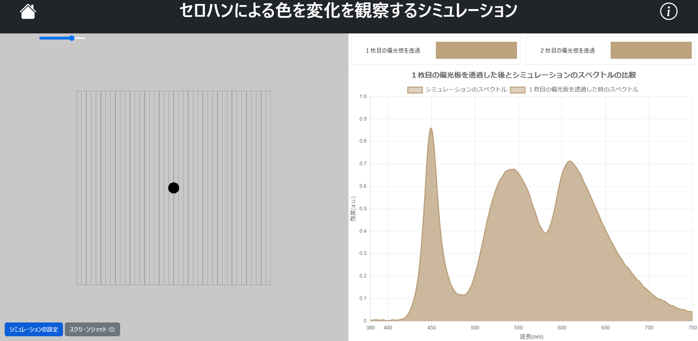
    
図9 シミュレーションの初期画面

初期画面では，セロハンテープが貼られていない偏光板が表示されている(図9)。PCのような液晶画面は直線偏光を出すことで知られ，白色画面の前に図10のようにかざした状況を想定している。
    

        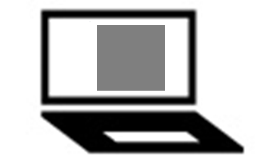
        
図10 偏光色アートにおける偏光板とその配置

    

1.左下の青色のボタンから，シミュレーションの設定を選択する。偏光板の重ね方，セロハンテープの光路差，セロハンテープの組数を入力する画面が表示される(図11)。

    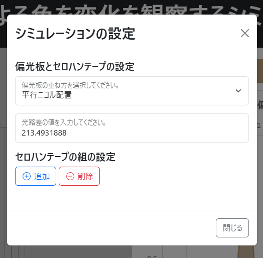
    
図11 シミュレーションの設定画面

偏光板の重ね方，セロハンテープの光路差，セロハンテープの組数を入力する画面が表示される。セロハンの組は4組までが計算の負担上好ましい。
偏光板は，平行ニコル配置と直交ニコル配置が選択できる。これは，図12のように液晶画面の直線偏光と偏光板の透過軸が平行な場合が平行ニコル配置，図13のように直交する場合が直交ニコル配置となる．

    

        

            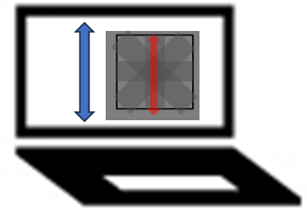
            
図12 平行ニコル配置

        

        

            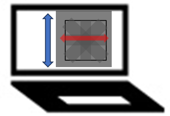
            
図13 直交ニコル配置

        

    

2.図11から，テープの光路差を変更できる。テープ1枚当たりの光路差には個体差がある。複数の測定から，一般のセロハンテープの光路差は260~380 nmの間に分布していることが確認されており，その間を選択するとよい(図14)。このシミュレーションでは380 nmの波長での光路差を入力することで，図11のような波長による光路差の変化を反映させた数字をプログラムに取り込み，数値計算から色を算出している。

    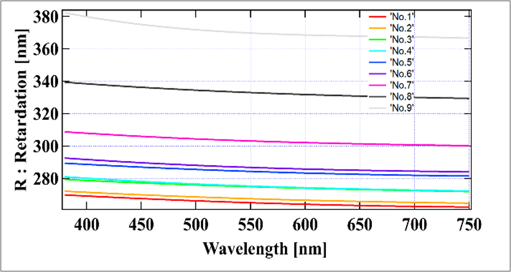
    
図14 9種類のセロハンテープの光路差の実測値

3. 1.2を踏まえたシミュレーションの操作と実際

    <video width="80%" height="auto" controls>
        <source src="./映像1.mp4" type="video/mp4">
        お使いのブラウザは動画タグに対応していません。
    </video>
    
図15 実際のシミュレーションの様子

4.画面左上のスライダーを調節することで，セロハンテープの幅を変更できる。実物と比較する場合に，実物に応じて調節されたい。

    

        

            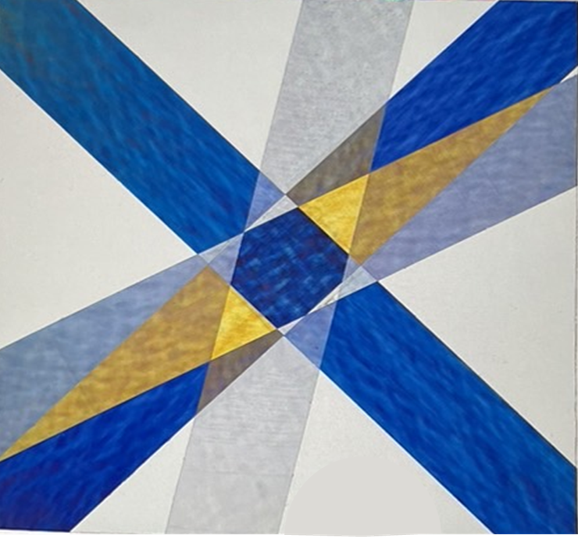
            
図16 実際の偏光色アートの例

        

        

            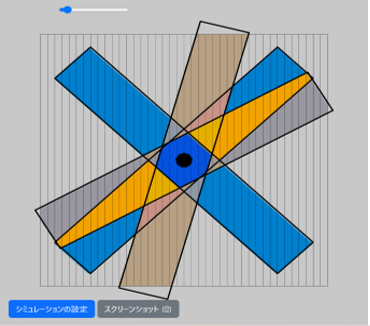
            
図17 シミュレーションによる再現例

        

    

## 参考文献

[1] Austine Studios，「INSTALLATIONS，PROJECTS & CUSTOM POLAGE ART / SWARTHMORE COLLEGE，SWARTHMORE，PA」.(<https://www.austine.com/swarthmore-college>)

[2] Exploratorium, “Polarized-Light Mosaic,” accessed on 4.20,2024． (<https://www.exploratorium.edu/snacks/polarized-light-mosaic>)

[3] amazon.co.jp，「自由研究お助けキット  偏光板でにじ色を作ろう」(<https://www．Amazon.co.jp/偏光板でにじ色を作ろう-バラエティ-Gakken/dp/4057508562>）

[4] 吉田賢二，三野弘文 (2023) 「複屈折で偏光が変化する仕組みを理解する３Dシミュレーションの開発」，千葉大学国際教養学研究，7，165-178.（<https://opac.ll.chiba-u.jp/da/curator/900121522/S24326291-7-P165.pdf>)

[5] 吉田賢二，丸澤和晃，三野弘文 (2024) 「セロハンテープの組み合わせで変化する偏光色予測プログラムの性能向上」，千葉大学国際教養学研究，8，73-84.

[6] 丸澤和晃, 吉田賢二, 三野弘文(2024)「偏光色アートにおける色の変化を再現するシミュレーション教材の開発」，日本物理学会講演概要集,発行中．

[7] Aaron D. Slepkov, “Painting in polarization,” Am. J. Phys. 90(8), 617-624(2022).
