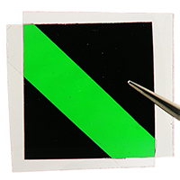
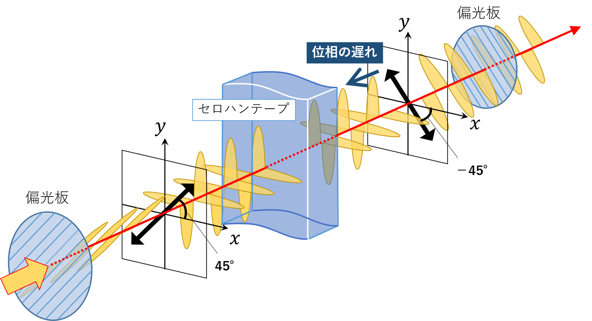

※上記の画像をクリックするとシミュレーションが起動します。

## 扱っている現象および本教材の説明

偏光板には様々な方向に振動している自然光を、振動方向が透過軸に平行な一方向の光に変換する性質がある。偏光板２枚を互いの透過軸が直交するように重ねると光が透過できなくなるが（図１）、偏光板の間にセロハンテープを挟むと一部の光が透過するようになり、透過した光は色づく（図２）。

    

        
        
図１ 直交に重ねた図

    

    

        
        
図２ 偏光色

    

この透過した光の発色は偏光色と呼ばれ、セロハンテープの枚数や観察する角度等で色を制御できることから、身近にアートや科学作品に用いられている。発色は複屈折を有するセロハンテープによって光の偏光が波長に依存して変化することに起因する（図３）。

    
    
図３ 偏光が変化する様子

本教材は、偏光色の仕組みの直観的な理解を目的として、光の波長やセロハンテープの枚数などの条件を設定し、セロハンテープを透過した光の偏光状態の変化を立体的な視点で観察することができる３ D シミュレーションである。

## 対象

既に波動について学習している高校生以上の生徒・学生

## 使用方法

二枚の偏光板が挟んでいるセロハンテープの枚数を変化させながら、偏光色の変化を観察する。
その際、入射光がセロハンテープを境にセロハンテープの幅方向と長さ方向で位相の遅れ方が異なることに注目する。

## 参考文献

- [吉田賢二・三野弘文（2023）：「複屈折で偏光が変化する仕組みを理解する３ D シミュレーションの開発」，千葉大学国際教養学研究，7，165-178．](https://opac.ll.chiba-u.jp/da/curator/900121522/S24326291-7-P165.pdf)
- [坂本舞衣・三野弘文（2021）：「セロハンテープの枚数で変化する偏光色の予測プログラムの開発」，千葉大学国際教養学研究，5，123-151．](https://opac.ll.chiba-u.jp/da/curator/109704/S24326291-5-P123.pdf)
